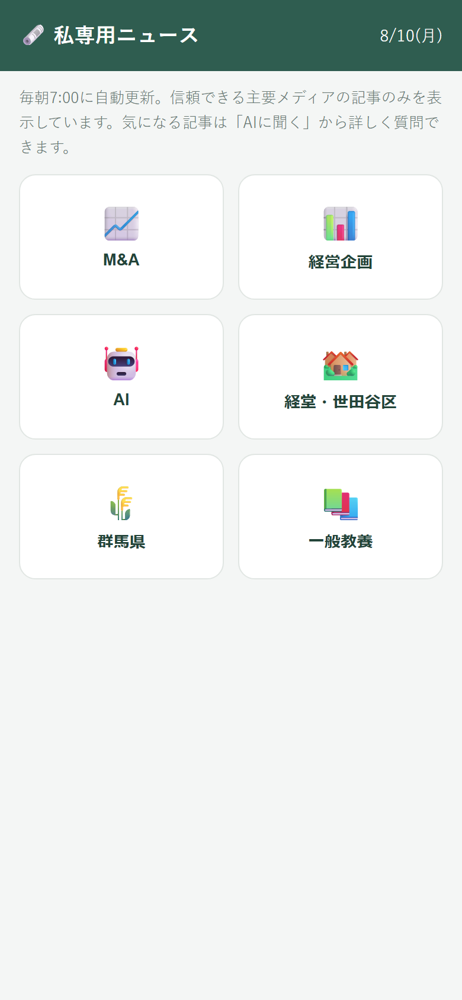
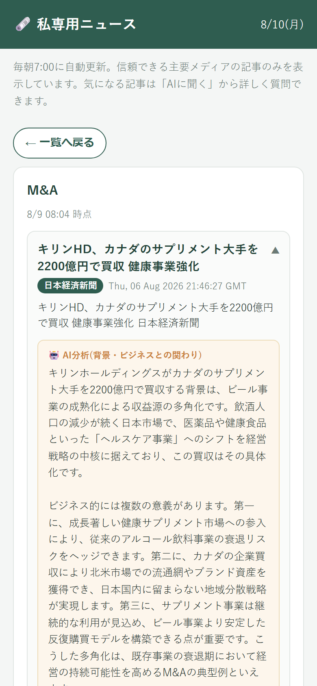
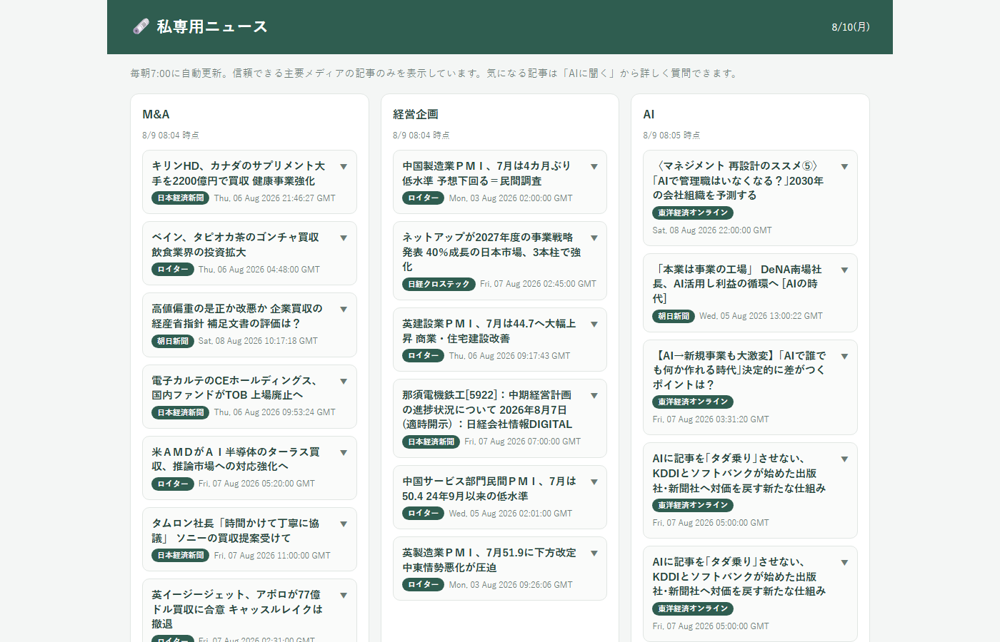

# 私専用ニュース (news-app)

6ジャンルのニュースを毎朝7時に自動収集し、記事ごとにAIの解説コメントを添えて読める「自分専用」ニュースPWAです。

> **個人利用前提のアプリです。** 利用者は作者1人だけという前提で設計しており、認証やデータ保護の構成もその前提に合わせて意図的に簡素化しています(詳細は[個人利用前提の設計について](#個人利用前提の設計について))。

## スクリーンショット

| カテゴリ一覧(スマホ) | 記事詳細 + AI解説 | PC表示(全ジャンル横並び) |
| --- | --- | --- |
|  |  |  |

## 解決する課題

一般のニュースアプリは「みんな向け」の編成なので、自分が本当に追いたいジャンルだけを毎朝まとめて読むことができません。このアプリは、

- 自分の関心ジャンル(M&A / 経営企画 / AI / 経堂・世田谷区 / 群馬県 / 一般教養 の6つ)だけを、
- 信頼できる主要メディアの記事に絞って、
- 毎朝7時に人手ゼロで自動収集し、
- 1記事ずつ「背景」と「ビジネスとの関わり」をAIが解説した状態で

読めるようにしたものです。朝の情報収集を自動化しつつ、ニュースを「ビジネスセンスを鍛える教材」として読むことを狙っています。

## 主な機能

- **6ジャンルの自動収集**: Google News RSSをジャンルごとの検索キーワードで取得(`scripts/fetch-news.js`)
- **信頼できる出典のみ表示**: NHK・日経・朝日・ロイター・ブルームバーグ等の許可リスト(`TRUSTED_SOURCES`)に部分一致した記事だけを残し、出所が確認しづらい記事は除外
- **AI解説コメント**: 記事ごとにClaude(claude-haiku-4-5)が「誰が何のために行ったのかという背景」「ビジネスとどう関わるか」を300〜400文字で解説
- **「もっとAIに聞く」ボタン**: 押すと記事情報入りの質問文がクリップボードにコピーされ、Claudeのチャット画面が新しいタブで開く(貼り付けるだけで深掘りできる)
- **スマホ/PCでレイアウト自動切替**: スマホでは「カテゴリ一覧 → タップで詳細」の2階層、PC幅では全ジャンル横並びの一覧表示
- **PWA対応**: iPhoneのホーム画面に追加してネイティブアプリのように起動できる(manifest / アイコン / セーフエリア対応済み)

## 技術スタック

| 領域 | 技術 |
| --- | --- |
| フロントエンド | HTML / CSS / Vanilla JavaScript(ビルド不要・フレームワーク不使用) |
| データベース | Cloud Firestore(Firebase JS SDK 10.x をCDNから読み込み) |
| ホスティング | Firebase Hosting |
| 定期実行 | GitHub Actions(cronスケジュール) |
| 収集スクリプト | Node.js 20 + `fast-xml-parser`(RSS解析)+ `@anthropic-ai/sdk`(AI解説生成) |
| AIモデル | Claude(claude-haiku-4-5) |

フロントエンドは意図的にビルドレス構成にしており、`index.html` / `app.js` / `style.css` をそのまま配信するだけで動きます。

## 設計上の工夫

### 毎朝の自動収集の仕組み(GitHub Actions cron)

`.github/workflows/fetch-news.yml` が毎日 22:00 UTC(= 日本時間 7:00)に起動し、`scripts/fetch-news.js` を実行します。

```
GitHub Actions (cron: 毎朝7:00 JST)
  └─ fetch-news.js
       ├─ ジャンルごとにGoogle News RSSを検索取得(6ジャンル × 最大20件)
       ├─ 出典の許可リストで絞り込み(→ 各ジャンル最大8件)
       ├─ 記事ごとにClaudeで解説コメントを生成(レート制限を避けるため直列実行)
       └─ Firestoreの newsItems/{カテゴリID} にREST APIでPATCH書き込み
                │
ブラウザ(PWA) ─┴─ Firestoreから読むだけ。表示時にサーバー処理は不要
```

- 収集(書き込み)と閲覧(読み取り)を完全に分離しているため、**閲覧側には自前のサーバーが1台も要らない**構成です
- `ANTHROPIC_API_KEY` はGitHub Actionsのリポジトリシークレットにのみ保存し、コードには一切書いていません。キーが無い環境ではAI解説だけをスキップして動くようにしてあり、ローカルでの動作確認にキーは不要です
- AI解説の生成はあえて直列にして、APIのレート制限に当たりにくくしています

### 表示品質のための小さな工夫

- Google News RSSのタイトル末尾に重複して付く発行元名を除去
- 説明文はHTMLタグを剥がしたうえで「タイトルと同一・空・300文字以上」のものを非表示(表示価値が低いため)
- iOS Safari対策: `await`後の`window.open()`がポップアップブロックされる問題を、**先に同期的にタブを開いてからクリップボードに書き込む**順序で回避(`app.js`の`handleAskAi`)

## 個人利用前提の設計について

このアプリは**作者1人だけが使う前提**で作っており、以下は意図的な簡素化です。そのまま不特定多数向けサービスに流用しないでください。

- **認証なし**: Firestoreのセキュリティルール(`firestore.rules`)は個人利用の簡易ルールです。複数人向けにするならFirebase Authenticationの導入と、書き込みをサーバー側(サービスアカウント)に限定する構成が必要です
- **APIキー運用**: `firebase-config.js` に含まれるFirebaseのWeb APIキーは、Firebaseの設計上クライアントに配布される公開識別子であり、秘密情報ではありません(アクセス制御はセキュリティルール側で行う設計)。一方、Anthropic APIキーは秘密情報なので、GitHub Secretsのみに保存しています
- **ジャンル構成のハードコード**: 利用者が自分だけなので、ジャンルやキーワードは`scripts/fetch-news.js`の定数として直接編集する運用です

## セットアップ

### 前提

- Node.js 20 以上
- Firebaseプロジェクト(Hosting + Firestore)
- Anthropic APIキー(AI解説を使う場合のみ)

### ローカルでの動作確認

ビルド不要のため、静的ファイルサーバーを立てるだけです。

```bash
npx serve .
# 表示されたURL(例: http://localhost:3000)をブラウザで開く
```

### ニュース収集を手元で試す

```bash
cd scripts
npm install
node fetch-news.js
```

`ANTHROPIC_API_KEY` 環境変数が設定されていればAI解説付きで、無ければ解説なしで収集・保存されます。

### 本番デプロイ

```bash
firebase deploy
```

### 毎朝の自動収集を有効にする

1. リポジトリをGitHubにpush
2. リポジトリの Settings → Secrets and variables → Actions に `ANTHROPIC_API_KEY` を登録
3. `.github/workflows/fetch-news.yml` のcronにより毎朝7:00(JST)に自動実行(Actionsタブから手動実行も可能)

## ディレクトリ構成

```
news-app/
├── index.html / app.js / style.css   # フロントエンド(ビルド不要)
├── manifest.json / icons/            # PWA用マニフェストとアイコン
├── firebase-config.js                # Firebaseクライアント接続情報(公開可の識別子)
├── firebase.json / .firebaserc       # Firebase Hosting / Firestore設定
├── firestore.rules                   # Firestoreセキュリティルール(個人利用の簡易版)
├── .github/workflows/fetch-news.yml  # 毎朝の自動収集(GitHub Actions cron)
└── scripts/
    ├── fetch-news.js                 # 収集・選別・AI解説生成・Firestore書き込み
    └── package.json                  # fast-xml-parser / @anthropic-ai/sdk
```
